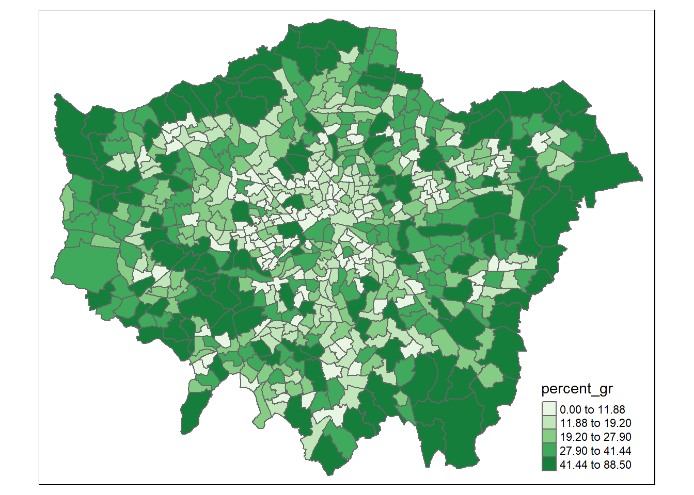
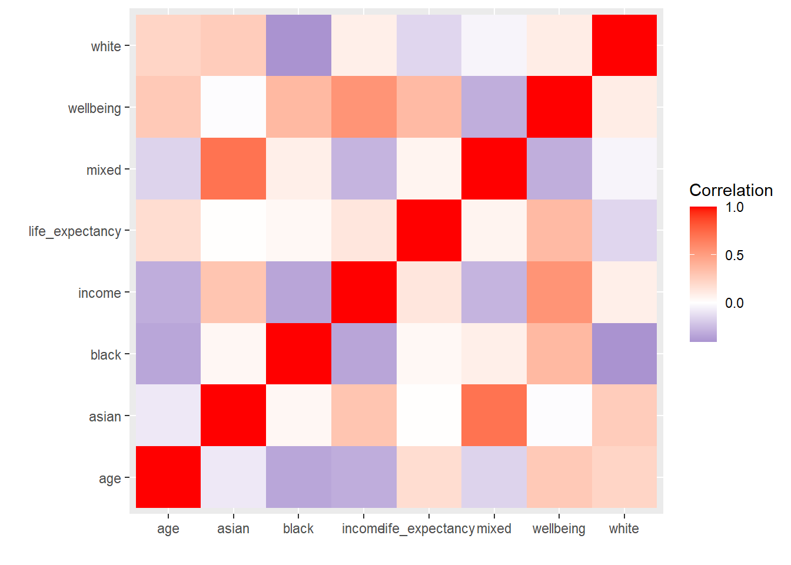
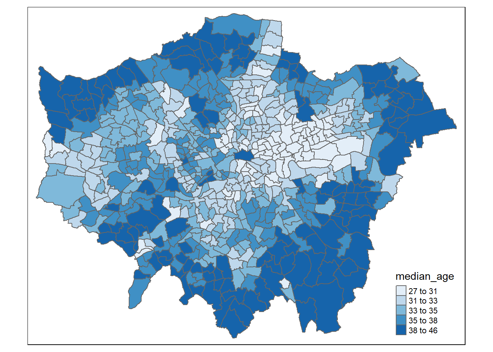
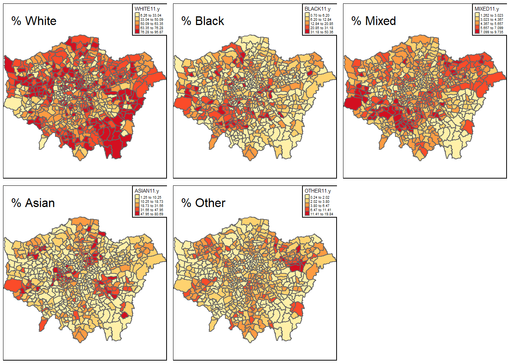
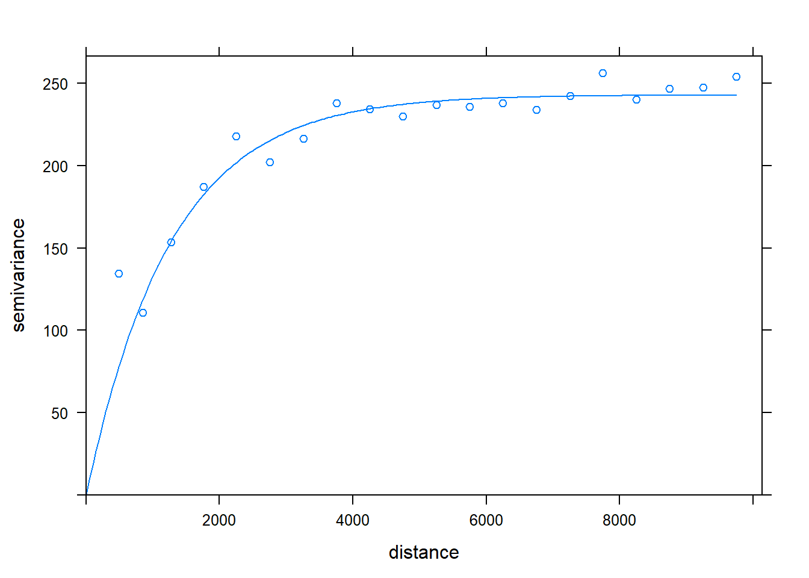
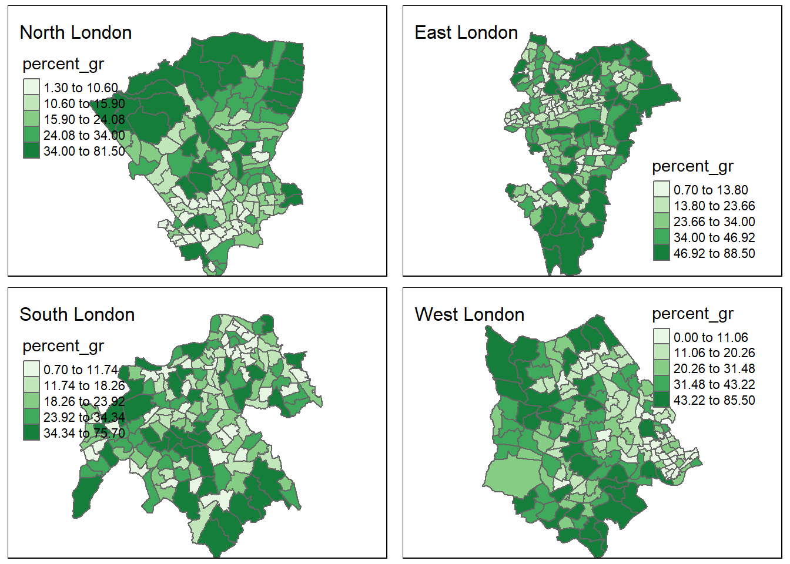
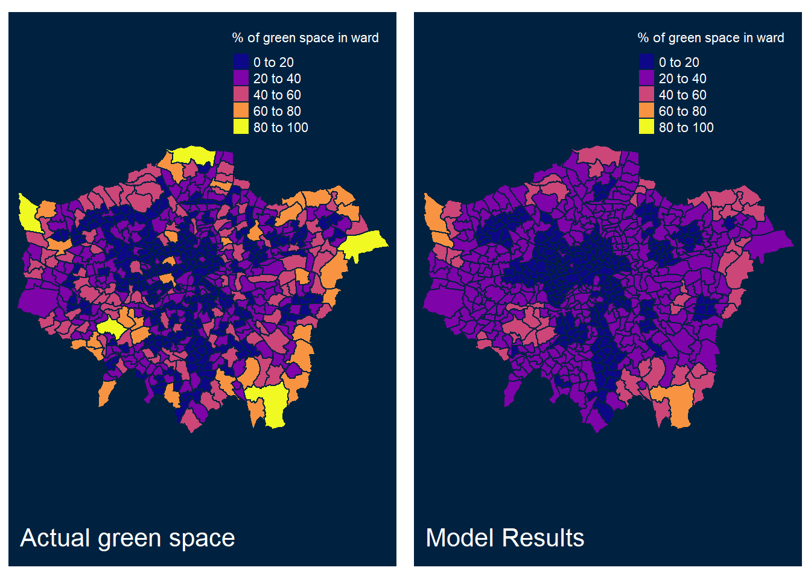
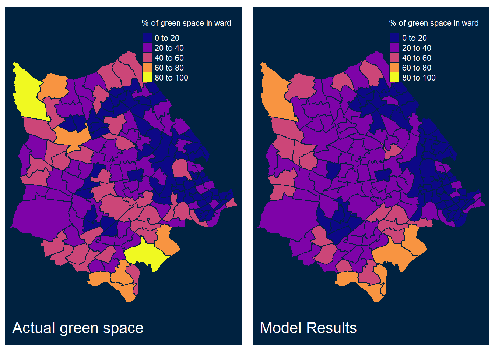

# Spatial-Econometrics

A collaborative report written in R as part of the Spatial Analysis and Geocomputation module during my Geospatial Sciences, GIS and Computing MSc (Distinction, 82%). The report compares five spatial regression models predictive power in determining green space in London: Spatial Lag, Spatial Error, Spatial Durbin, Geographically Weighted Regression (GWR) and Linear Regression with Spatial Filtering. 

[Link to the Report (HTML)](https://tdayeni.github.io/Spatial-Econometrics/)

## Example of Results and Visualisations
Percentage Green Space per Ward in Greater London             |  Correlation Matrix for Dependent Variables
:-------------------------:|:-------------------------:
  |  

Median Income per Ward in Greater London      |  Ethnicity Distribution per Ward in Greater London
:-------------------------:|:-------------------------:
  |  

Green Space Semivariogram       | Percentage Green Space per Ward in Greater London (North, East, South and West)
:-------------------------:|:-------------------------:
  |  

Fitted and Observed Values of % Green Space per Ward in Greater London      | Fitted and Observed Values of % Green Space per Ward in West London
:-------------------------:|:-------------------------:
  |  

<!-- Inline-1: 

Inline-2: 

Inline-3: 
 -->